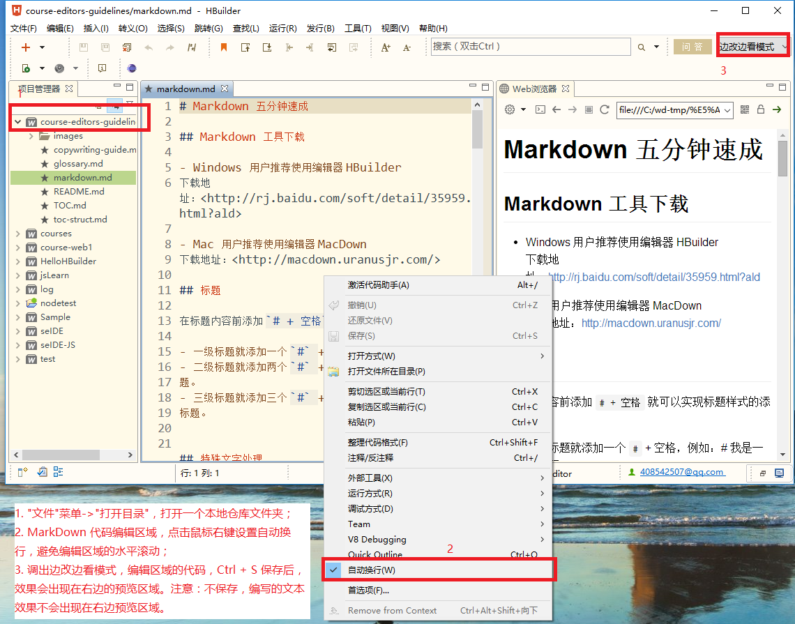

# Markdown 五分钟速成

## Markdown 工具下载

- Windows 用户推荐使用编辑器 HBuilder  
下载地址：<http://rj.baidu.com/soft/detail/35959.html?ald>

  Hbuilder 的快速使用指南，见下面截图中的文字标注。  

  
- Mac 用户推荐使用编辑器 MacDown     
下载地址：<http://macdown.uranusjr.com/>

## 标题

在标题内容前添加 `# + 空格` 就可以实现标题样式的添加：

- 一级标题就添加一个 `#` + 空格，例如：# 我是一级标题
- 二级标题就添加两个 `#` + 空格，例如：## 我是二级标题。
- 三级标题就添加三个 `#` + 空格，例如：### 我是三级标题。 


## 特殊文字处理

### 换行

书写示例：

```
我是第一行（后面有两个空格）  
我是第二行
```

效果：  

我是第一行（后面有两个空格）  
我是第二行

### 加粗

书写示例：

```
**我是粗体**
```

效果：  
**我是粗体** 

### 标亮

书写示例：

```
`请把我标亮`
```

效果：  

`请把我标亮` 

## 列表

### 一级列表（不带序号）

书写示例：

```
- 列表 1（减号 + 空格）
- 列表 2
```

效果：

- 列表 1（减号 + 空格）
- 列表 2

### 一级列表（带序号）

书写示例：

```
1. 列表 1（自然数 + 点 + 空格）
2. 列表 2
```

效果：

1. 列表 1（自然数 + 点 + 空格）
2. 列表 2

### 二级列表（不带序号）

书写示例：

```
- 列表 1（一级列表：减号 + 空格）
 - 列表 1.1（二级列表：空格 + 减号 + 空格）
 - 列表 1.2
- 列表 2
```

效果：

- 列表 1（一级列表：减号 + 空格）   
 - 列表 1.1（二级列表：空格 + 减号 + 空格）   
 - 列表 1.2   
- 列表 2

## 添加图片

书写示例：

```

```

效果：  

    

## 添加超链接  

书写示例：

```
[链接描述文字（可见）](链接地址)
```

效果：  

[点击跳转到王顶老师的课程页面](http://edu.51cto.com/lecturer/user_id-8606427.html) 

## 引用

书写示例：

```
>注意：  
我是引用的内容（空一行就结束引用）。
```

效果：
  
>注意：  
我是引用的内容（空一行就结束引用）。


## 添加代码

书写示例：

<pre>
```java
// 代码区域的上下分别用三个 ` 括起来
public class Person {
    // 代码缩进请使用 四个空格，不要使用 Tab
}
```
</pre>

效果： 

```java
// 代码区域的上下分别用三个 ` 括起来
public class Person {
    // 代码缩进请使用 四个空格，不要使用 Tab
}
```

支持的语法：

- bash, java, html, css, javascript, json, xml, ini,
- actionscript, apache, clojure, cmake, coffeescript, cpp, cs, d, delphi, django, erlang, go, smalltalk, sql, 
- haskell, http, lisp, lua, markdown, matlab, nginx, objectivec, perl, php, python, r, ruby, scala,tex, vbscript

