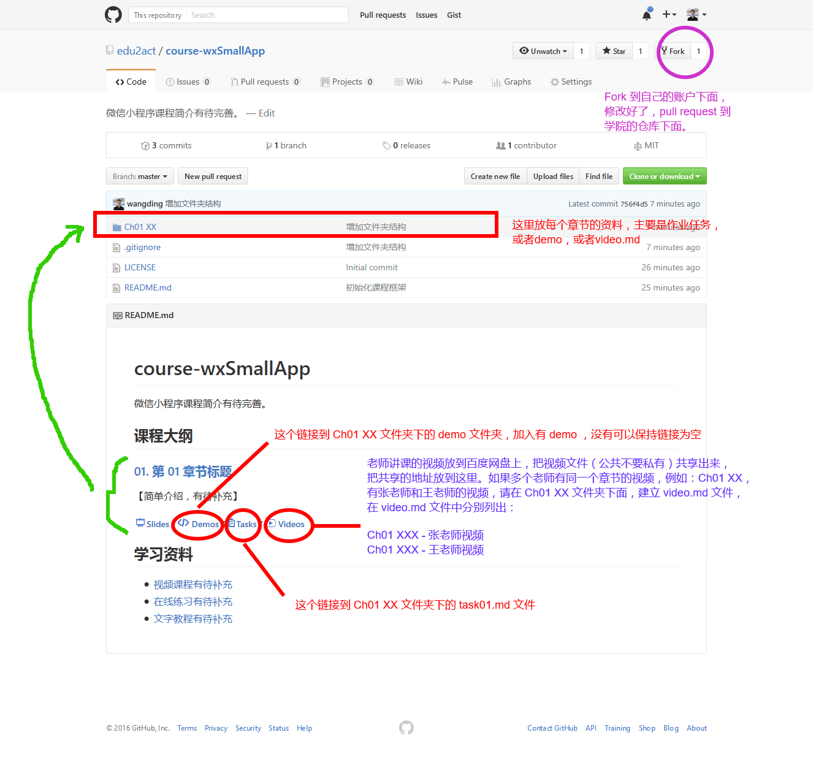

# 文件结构

## 大型课程的文件结构

- **ChXX title/** - 存放章节下的资料，通常包括：作业任务、幻灯片和示例代码等。例如：Ch01 introduction
 
- **images/** - 存放图片（用到的图片文件都放在这）

- **README.md** - 课程主页

- **taskXX.md** - 作业任务，例如：task01.md

- **XX.html** - 课程简介页面，例如：season01.html

## 小型课程的文件结构

参考上面大型课程的文件结构，去掉章节文件夹，各种资料在一个课程目录中，扁平化存放。
